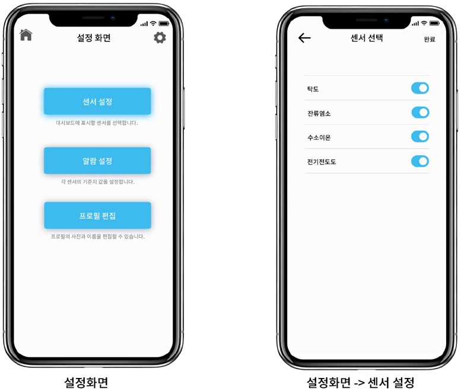

# Cloud Service

RSX431수질감기 모니터링시스템은 다양한 종류의 수질감지 센서를 하나의 시스템으로 구성하여 수돗물의 수질을 실시간으로 자동연속 측정하여 서버로 데이터를 전송하는 장치입니다. 

㈜ 알앤에스랩에서 제공하는 Cloud service를 이용하면 사용자 권한의 PC웹이나 모바일 앱에서 데이터를 확인할 수 있습니다. 사용자 권한은 제품이 출하할 때 사용자에게 전달되며 접속을 위한 아이디 및 비밀번호는 사용자가 철저히 관리하여야 합니다.

## 1. WEB 서버에서 확인

웹서버에 접근하기 위해서는 우선 사용자의 수질감지 모니터링 시스템에 제품등록을 하여야 합니다. 모바일 앱을 열어서 제품등록 메뉴를 선택하신 후 제품번호의 **QR코드**를 스캔하여 등록하시기 바랍니다. QR코드는 도어 안쪽에서 확인할 수 있습니다.


* Cloud service 주소: [https://52.79.50.2](https://52.79.50.2) 
* 아이디 및 비밀번호: 사용자에게 별도 제공 
* 데이터 전송주기: **3분** 
* RSX431 수질감지 모니터링 시스템이 수집한 데이터는 서버 용량의 한계로 서버에 장기간 보관할 수 없습니다. 사용자가 원하시는 장기간의 데이터는 사용자가 다운로드하여 보관하여야 합니다.


웹서버의 데이터는 아래와 같이 제공됩니다.

## 2. 모바일 앱에서 확인

㈜ 알앤에스랩에서 제공하는 모바일 앱은 아래와 같이 다운로드하여 모바일 기기에 설치하여 사용할 수 있습니다. 

모바일 앱은 안드로이드 및 iOS 기기 모두 사용이 가능하며, 사용자 권한은 제품이 출하할 때 사용자에게 전달됩니다. 접속을 위한 아이디 및 비밀번호는 사용자가 철저히 관리하여야 합니다.


* 안드로이드 및 IOS 기기 사용 
* 안드로이드 APP: 구글 플레이스토어에서 “**WQS Data logger**” 검색하여 다운로드 
* IOS APP: 애플스토어에서 “**WQS Data logger**” 검색하여 다운로드
* 회원가입이 필수이며, 수질센서의 모든 데이터를 모바일에서 보실 수 있습니다. 
* RSX431 수질감지 모니터링 시스템이 수집한 데이터는 서버 용량의 한계로 서버에 장기간 보관할 수 없습니다. 사용자가 원하시는 장기간의 데이터는 사용자가 다운로드하여 보관하여야 합니다.


모바일 앱에서 데이터를 확인하기 위해서는 먼저 제품등록을 하여야 합니다. **도어 안쪽의 QR코드를 스캔**하여 제품등록을 하시기 바랍니다. 

모바일 앱의 구성은 다음과 같습니다.

### 회원가입 및 로그인

사용자는 모바일 앱에 회원가입을 하여야 사용하실 수 있습니다. 간단한 회원가입을 하신 후 사용하시기 바랍니다.

### 대시보드 \(메인화면\)

대시보드는 수질감지 모니터링 시스템에 장착된 수질센서의 실시간 측정값을 모두 표시합니다. 수질센서는 **탁도, 잔류염소, 수소이온온도, 전기전도도** 등이 기본 제공됩니다. 

각각의 수질센서의 알람 범위를 설정하였다면 알람 범위를 벗어났을 경우 대시보드에서 즉시 확인할 수 있습니다.

### 데이터 및 그래프

대시보드에서 자세한 데이터 및 데이터의 트랜드를 확인하기 위해 수질센서의 데이터 박스를 클릭하시면 상세한 **수질 데이터와 그래프 트랜드**가 표시됩니다. 

데이터는 실시간 측정값이 연속으로 자동 표시되며 그래프도 함께 자동 표시됩니다. 그래프의 표시구간을 사용자가 변경하여 수질 데이터의 트랜드를 간단하게 분석할 수도 있습니다. 

만약, 각각의 수질센서의 알람 범위를 설정하였다면, 알람도 함께 표시되어 수질의 상태를 한눈에 확인하실 수 있습니다.

### 설정

설정화면에서는 각 센서의 선택, 알람 범위 설정, 프로필 편집 등이 있습니다. 

각 센서의 선택은 수질감지 모니터링 시스템에 장착된 센서를 확인하신 후 선택을 하시면 실시간 측정 데이터를 확인하실 수 있습니다. 알람 범위는 수질 데이터의 관리를 위해 범위를 설정하시면 대시보드 화면 등에서 알람이 표시됩니다.

