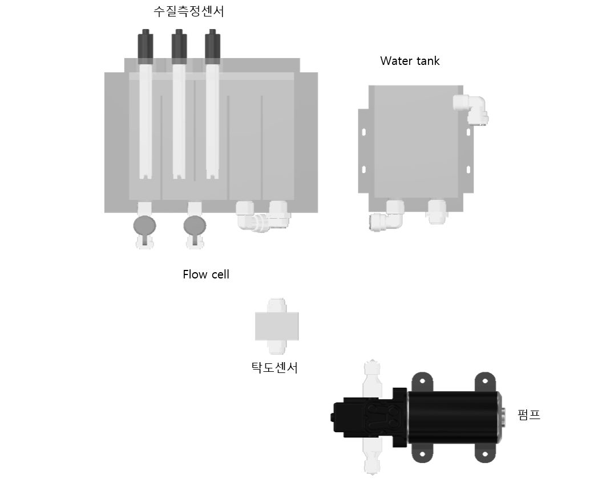
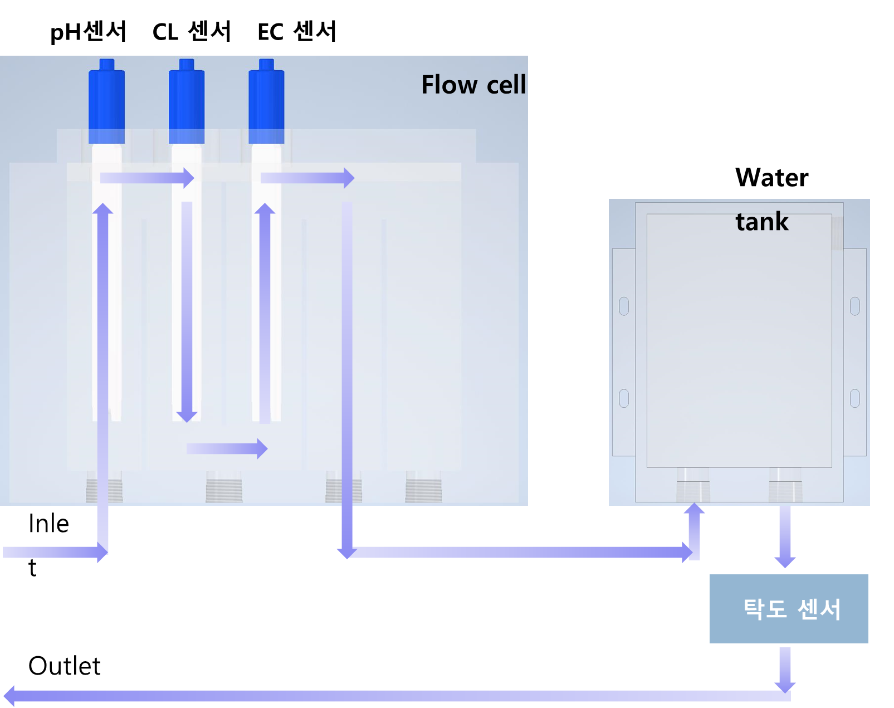
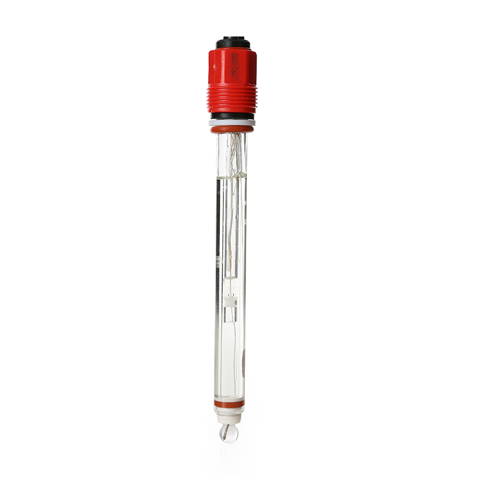
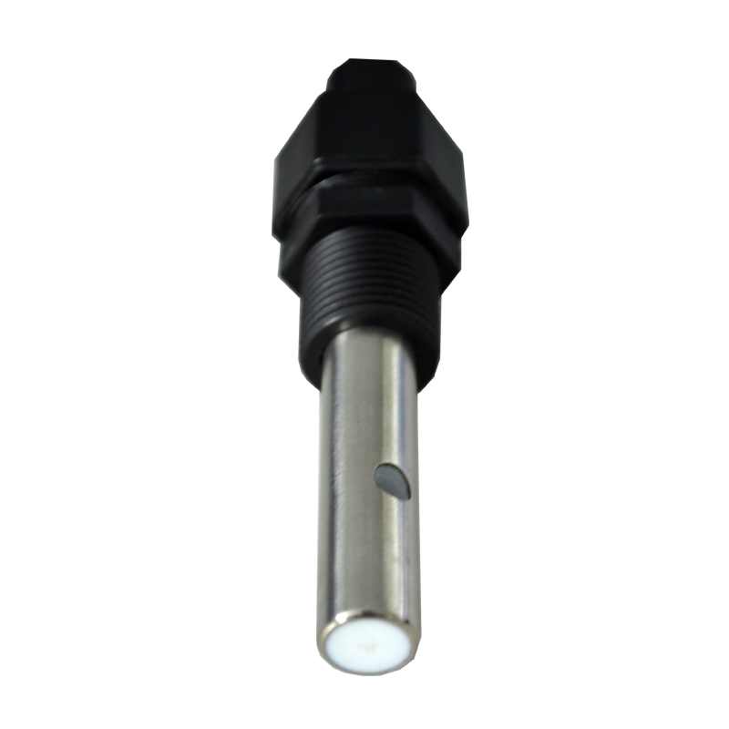
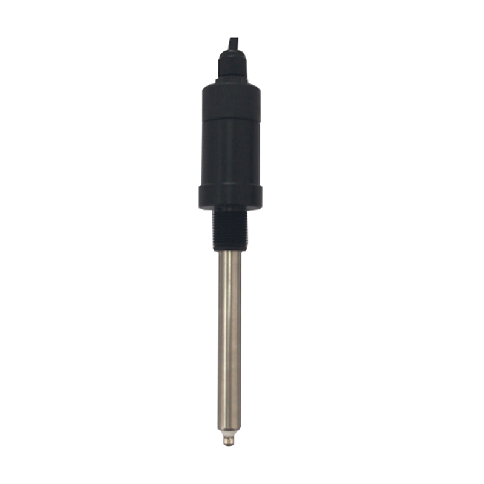
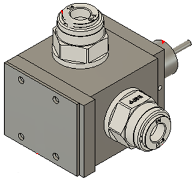

# RSX431 제품의 개요

## 시스템의 기본 구성

수질 측정 시스템의 내부 구성은 아래 그림 1. 과 같다.

## **수질 측정 방법** 

1. 그림 2와 같이 수질측정기 내부에서 물은 Flow cell, water tank 와 탁도 센서를 거쳐 출수구를 통해 측정기 밖으로 배출된다.
2. Flow cell로 유입된 물은 수소이온농도 센서, 잔류염소 센서, 전기전도도 센서 순서로 흐른다.

## 수질 측정 센서 

* 수소이온농도 \(pH\) 센서 

<table>
  <thead>
    <tr>
      <th style="text-align:center">
        
      </th>
      <th style="text-align:left">
        
&#xCE21;&#xC815; &#xBC94;&#xC704; : 0 - 14 pH

        
&#xBD84;&#xD574;&#xB2A5; : 0.01 pH

        
&#xC815;&#xD655;&#xB3C4; : &#xB1;0.1 pH

      </th>
    </tr>
  </thead>
  <tbody></tbody>
</table>

* 전기전도도 \(EC\) 센서 

<table>
  <thead>
    <tr>
      <th style="text-align:center">
        
      </th>
      <th style="text-align:left">
        
&#xCE21;&#xC815; &#xBC94;&#xC704; : 0-2000uS/cm

        
&#xBD84;&#xD574;&#xB2A5; : 50 uS/cm

        
&#xC815;&#xD655;&#xB3C4; : &#xB1;1%FS

      </th>
    </tr>
  </thead>
  <tbody></tbody>
</table>

* 잔류염소 센서 

<table>
  <thead>
    <tr>
      <th style="text-align:center">
        
      </th>
      <th style="text-align:left">
        
&#xCE21;&#xC815; &#xBC94;&#xC704; : 0.0mg/L&#xFF5E;10.0mg/L

        
&#xBD84;&#xD574;&#xB2A5; : 0.01 mg/L

        
&#xC815;&#xD655;&#xB3C4; : &#xB1;0.02mg/L

      </th>
    </tr>
  </thead>
  <tbody></tbody>
</table>

* 탁도 센서 

<table>
  <thead>
    <tr>
      <th style="text-align:center">
        
      </th>
      <th style="text-align:left">
        
&#xCE21;&#xC815; &#xBC94;&#xC704; : 0 ~ 5 NTU

        
&#xBD84;&#xD574;&#xB2A5; : 0.01 NTU

        
&#xC815;&#xD655;&#xB3C4; : &#xB1;0.05 NTU

      </th>
    </tr>
  </thead>
  <tbody></tbody>
</table>

