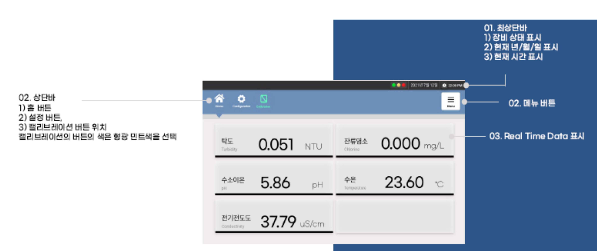

# RSX431 사용방법

## 1. 제품의 설치 

수질감지 모니터링 시스템의 측면 연결부는 다음과 같습니다.

### 급수\(Inlet\) / 배수\(Outlet\) 라인 호스의 연결

1. 급수 \(Inlet\) 연결부의 호스는 **1/4-inch**, 배수\(Outlet, Drain Line\) 연결부의 호스는 **3/8-inch** 플라스틱 호스를 사용합니다. 
2. 급수라인 호스는 장치의 좌측 급수 연결부 \(1/4-inch\)에 연결합니다. 퀵 커넥터로 구성되어 플라스틱 호스를 커넥터에 맞추어 넣고 밀어서 완전히 밀착하게 연결합니다. 
3. 배수라인 호스도 장치의 좌측 배수 연결부 \(3/8-inch\)에 연결합니다. 급수 연결부와 동일하게 연결합니다.

### 이더넷\(LAN\) 케이블의 연결

1. 컴퓨터의 측정 데이터를 서버로 전송하기 위해 이더넷\(LAN\) 케이블을 인터넷 단자에 연결해야 합니다. 인터넷이 연결되면 모바일 앱 및 PC에서 데이터 확인이 가능합니다. 
2. 기본 제공되는 **이더넷 케이블은 5M**입니다. 추가로 케이블이 필요하시면 구매하여 사용하시기 바랍니다. 
3. 인터넷 연결을 위한 공유기 등 추가 부속품은 제공되지 않습니다. 사용자가 미리 준비하시기 바랍니다.

### 전원 케이블의 연결

1. 전원은 가정용 AC 220V에 맞게 설계되었습니다. 가정용 전원에 연결합니다. 
2. 기본 제공되는 **전원 케이블은 5M**입니다. 추가로 케이블 연장이 필요하시면 구매하여 사용하시기 바랍니다. 
3. **전원 플러그는 방수/방습 기능이 없습니다.** 사용에 주의하시기 바랍니다.

### 메탈박스 도어 및 전원스위치

1. 메탈박스 **도어는 잠금 장치가 있습니다.** 제공되는 키\(열쇠\)를 사용하십시오. 
2. 도어는 방수/방습 기능이 있습니다. 항상 도어를 닫을 때는 **도어의 우레탄 가스켓**이 깨끗한 상태가 유지되었는지 확인한 후 도어 가스켓이 완전히 밀착이 되도록 하여 도어를 닫아 주십시오. 
3. 도어는 **항상 닫힌 상태를 유지하십시오.** 열린 상태에서는 장치의 오염이나 방수/방습 기능이 유지될 수 없어 고장의 원인이 됩니다. 
4. **전원 스위치는 도어 안쪽**에 위치합니다. 전원스위치는 방수/방습 기능이 있습니다. 정전이나 사용하지 않을 경우는 받드시 전원을 OFF\(끔\) 상태로 유지하십시오. 
5. **전원은 가정용 220V를 사용**합니다. 부상이나 화상을 방지하기 위해 전원스위치는 물기를 완전히 제거한 상태에서 작동하십시오. 
6. 도어에 부착된 아크릴 판넬은 내부의 회로 및 컴퓨터를 보호하기 위해 설치 되었습니다. 완전한 방수기능을 제공하지 않습니다. 사용에 주의하시기 바랍니다.


도어에 부착된 **어떠한 것도 열거나 분리/분해하지 마십시오.** 기기의 심각한 손상을 초래하며 유지보수 서비스를 받으실 수 없습니다.


### RSX431 설치

제품의 설치는 다음을 유의하여 설치하시기 바랍니다.

1. RSX431은 옥내외 자립형 설치와 벽부형 설치가 모두 가능하도록 설계되었습니다. 
2. 자립형 설치는 바닥이 평평한 곳에 장치를 설치하십시오. 충격과 진동을 방지하기 위해 메탈박스 바닥에 **방진고무\(4개\)**가 장착되어 있습니다. 
3. 자립형 설치는 완전히 고정되어 있지 않으므로 장치가 넘어지지 않도록 주의하십시오. 
4. **벽부형 설치는 사용자의 요청에 따라 설치**가 가능합니다. \(선택사항\) 
5. 벽부형 설치를 위한 기본 구성은 아래의 그림과 같이 5종의 구성품으로 구성되며 메탈박스의 타공 \(4곳\)도 필요합니다. 따라서, **추가 비용이 발생됩니다.** 
6. 벽부형 설치는 완전히 고정되어 설치되므로 자립형 보다 안전하게 장치를 유지할 수 있습니다. **벽부형 설치는 메탈박스의 방수/방습 기능이 유지**되도록 설계되었습니다.

## 2. 제품의 사용방법

### 전원연결 및 프로그램 자동실행

1. RSX431 수질감지 모니터링 시스템은 **가정용 AC 220V**를 사용합니다. 
2. 전원 플러그를 가정용 전원에 연결합니다. 
3. 제공된 도어키를 이용하여 도어를 열어 전원스위치를 ON\(켬\) 합니다.
4. 전원을 연결하면 자동으로 컴퓨터 부팅이 시작되며 장치에 워터펌프가 장착되어 있다면 워터펌프가 동작하여 원수\(물\)를 Flow cell에 공급합니다. 
5. 컴퓨터 부팅이 종료되면 **자동으로 수질 측정**을 시작합니다. 
6. 수질을 측정한 데이터는 장치의 모니터에 표시되어 실시간 데이터로 수질의 상태를 확인할 수 있습니다. 


컴퓨터의 에러발생이나 장치의 오류가 발생되면, 사용자가 직접 조치를 하기 전에 ㈜알앤에스랩의 기술지원을 받으십시오


### 프로그램 동작순서

프로그램이 자동 실행되면 다음과 같은 알고리즘으로 프로그램이 운영됩니다.

## 3. 수질 측정 데이터의 확인

RSX431 수질감지 모니터링 시스템의 측정데이터 확인은 장치의 도어에 장착된 컴퓨터 스크린을 통해 실시간 데이터를 확인할 수 있습니다. 인터넷이 연결된 상태에서는 모바일 앱 및 PC를 통해서도 가능하며 서버 데이터를 다운로드하여 데이터의 분석도 가능합니다. 

컴퓨터 프로그램의 구성은 대시보드\(Dashboard\), 데이터, 그래프, 보정, 설정 화면으로 구성되어 있으며 각각의 기능은 다음과 같습니다.

* **대시보드 \(Dashboard\)**: 초기 화면\(Home\)으로 장착된 센서의 측정값을 모두 표시되며 측정값은 실시간으로 표시됩니다. 설정화면에서 알람 범위를 설정하였다면 알람 범위가 벗어나면 알람 메세지가 표시됩니다.
* **데이터 \(Data Screen\)**: 개별 센서의 측정값을 텍스트 형태로 실시간 표시됩니다. 보다 자세한 트랜드를 보기 원하시면 상단의 그래프 아이콘을 클릭하면 데이터 트랜드가 표시됩니다.
* **그래프 \(Graph Screen\)**: 개별 센서의 측정값을 그래프 형태로 실시간 표시됩니다. 수질 데이터의 트랜드 분석에 활용할 수 있습니다.
* **보정 \(Calibration Screen\)**: 개별 센서의 보정을 할 수 있습니다. 각각의 센서는 보정주기에 반드시 보정을 실시하여야 합니다. 보정기능은 완전히 장치를 숙지한 상태에서 조작하시기 바랍니다. 잘못된 보정은 측정값 오류의 원인이 됩니다.
* **설정 \(Configuration\)**: RSX431 장치의 기본적인 설정을 할 수 있습니다. 설정은 센서 옵션, 네트워크 옵션, 센서의 알람 범위 설정 등이 있으며, 각각의 설정에 대해서 완전히 숙지한 후에 조작하십시오.


RSX431 수질감지 모니터링 시스템이 수집한 데이터는 서버 용량의 한계로 서버에 장기간 보관할 수 없습니다. 사용자가 원하시는 **장기간의 데이터는 사용자가 다운로드하여 보관**하여야 합니다.


### 대시보드 화면

프로그램이 자동 실행되면 수질을 자동으로 측정을 시작하며 측정된 데이터는 컴퓨터 모니터에 표시됩니다. 컴퓨터 대시보드 화면은 다음과 같습니다.

수질감지 모니터링 시스템에 장착된 센서의 측정값은 실시간으로 표시되며 각 센서의 알람 설정 범위를 벗어나면 알림이 표시됩니다. 장치의 오류나 이상발생도 함께 표시되어 장치의 상태를 한 번에 확인할 수 있도록 설계되었습니다.

### 데이터 및 그래프

RSX431 수질감지 모니터링 시스템에는 장착된 개별센서의 데이터를 확인할 수 있는 화면과 데이터의 트랜드를 확인할 수 있는 화면이 준비되어 있습니다. 개별 센서의 측정값의 트랜드를 확인하여 수질 측정값의 변화를 분석할 수 있습니다.

데이터 및 그래프 화면에 대한 설명은 다음과 같습니다.

## 4. 시스템 설정 \(Configuration\)

RSX431 수질감지 모니터링 시스템을 사용하기 전에 사용자의 환경에 맞게 옵션이나 기타 시스템 설정 값을 셋업 합니다. 시스템 설정 값은 제품은 출하 전에 사용자에 맞게 미리 설정됩니다. 하지만, 사용자의 환경이 변화에 따라 설정 값을 변경하여 사용할 수 있도록 설계되어 있습니다. 

상단 메뉴의 Configuration을 클릭하면 시스템의 설정화면으로 들어갑니다.

#### 옵션 선택

RSX431 수질감지 모니터링 시스템의 옵션은 워터펌프와 유량계 추가입니다. 

설정화면에서 해당 메뉴를 클릭하면 Enable / Disable이 번갈아 표시됩니다. 해당 옵션을 선택하고자 할 때는 Enable로 선택하시기 바랍니다.

#### 수질센서 선택

수질측정을 원하는 수질센서를 선택할 수 있습니다. 

* 기본 수질센서: 수소이온농도 센서, 전기전도도 센서, 잔류염소 센서, 탁도 센서
* 제품에 대한 문의 등 기타 자세한 사항은 ㈜ 알앤에스랩으로 연락 주시기 바랍니다.


수질감지 시스템에 사용자에 따라 수질센서를 추가 / 제거 할 수 있으며 초기 설정은 출하 전에 사용자에 맞게 미리 설정됩니다. 임의로 조작하시면 시스템의 오류가 발생됩니다. 주의하시기 바랍니다.


#### 알람선택

RSX431 수질감지 모니터링 시스템은 수질센서가 측정값에 대한 알람을 사용자가 설정할 수 있습니다. 

알람 범위는 수질 센서별로 각각 설정이 가능하며, 상한 값 \(Upper limit\)과 하한 값 \(Lower limit\)을 사용자가 설정을 하면 수질 센서가 측정한 측정값이 알람 범위를 벗어나면 대시보드 화면에서 알람 메시지가 표시됩니다. 

초기 출하할 때 초기 설정 값을 설정하여 출하됩니다. 설정 값은 먹는 물 수질기준에 맞게 셋팅 합니다.

