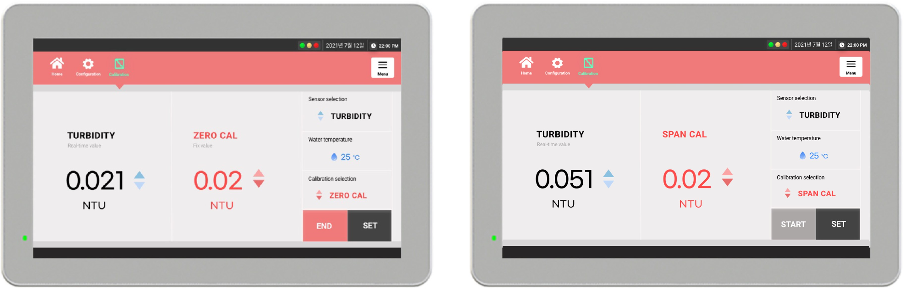
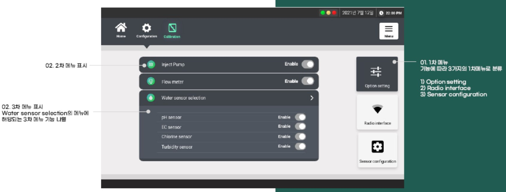

# RSX431 보정방법

RSX431 수질감지 모니터링 시스템에서 개별센서를 보정할 수 있는 기능이 있습니다. 각각의 센서는 보정주기에 따라 보정을 실시하여야 합니다. 

보정\(Calibration\)은 완전히 숙지한 상태에서 실시하여야 하며 잘못된 보정은 센서 측정값 오류의 원인이 됩니다. 각각의 센서 보정주기는 다음과 같습니다.

| 수질 센서 | 권장 보정주기 \(Calibration term\) |
| :---: | :---: |
| 탁도 \(Turbidity\) | 12 개월 \(설치환경 및 수질에 따라 변동됨\) |
| 잔류염소 \(Residual chlorine\) | 6 개월 \(설치환경 및 수질에 따라 변동됨\) |
| 수소이온농도 \(pH\) | 6 개월 \(설치환경 및 수질에 따라 변동됨\) |
| 전기전도도 \(EC\) | 6 개월 \(설치환경 및 수질에 따라 변동됨\) |

보정\(Calibration\) 화면은 다음 그림과 같습니다. 

상단의 Calibration 버튼을 클릭하면 접근이 가능하며, 보정은 **ZERO CAL과 SPAN CAL**로 나누어 있어 2-포인트 보정을 실시합니다.

보정\(Calibration\) 화면에 대한 각 부분 설명은 다음과 같습니다.

## 1. 수소이온농도 \(pH\) 센서

### 측정방법

수소이온농도 \(pH\)는 기준전극과 비교전극으로 구성되어진 pH 측정기를 사용하여 양전극 간에 생성되는 기전력의 차를 이용하여 측정하는 방법입니다. pH는 다음과 같은 식으로 정의됩니다.

$$
pH = F(Ex-Es)/2.303RT
$$

여기서, 

pH : 시료의 수소이온 농도 측정값   
F : 페러데이 \(Faraday\) 상수 \(9.649X104 Coulomb per mole\)   
Ex : 시료에서의 기준전극과 비교전극간의 전위차 \(mV\)   
Es : 표준용액에서의 기준전극과 비교전극간의 전위차 \(mV\)   
R : 기체상수 \(8.314 J_K-1_mole-1\)   
T : 절대온도 \(K\)

### 간섭물질

수소이온농도 \(pH\) 값은 온도에 영향을 받으며, 전극에 이물질이 달라붙어 있는 경우에는 수소이온 농도 전극의 반응이 느리거나 오차를 발생시킬 수 있습니다.

특히 pH 11이상의 알칼리성이나 pH 5 이하의 불화물 시료에서는 오차가 적은 특수 전극을 사용하는 것이 좋습니다. 하지만 먹는 물은 일반적으로 pH 6 ~ 8 사이이므로 일반적인 전극을 사용합니다. 기타 간섭물질은 연속적으로 측정하는 측정기의 원리 및 특성을 고려하여 제거할 수 있습니다.

### 표준용액

| 구분 | 표준용액 |
| :---: | :---: |
| 제로용액 | 정제수 \(탈이온수\) 또는 pH 7 Buffer 용액 |
| 스팬용액 | pH 4 또는 pH 10 Buffer 용액 |

### 보정방법

#### 제로보정 \(ZERO Calibration\)

1. 제로보정을 위한 표준용액을 준비한 후 수소이온농도 센서 유리전극\(Probe\)을 미리 준비한 정제수에 충분히 담가 둔다. 
2. 컴퓨터의 상단메뉴에서 Calibration 버튼을 클릭한 후 ZERO CAL을 선택한다. 
3. 우측 Sensor Selection 버튼에서 pH를 선택한다. 
4. 센서의 유리전극을 정제수에서 꺼내어 거름종이 등으로 가볍게 닦아낸다. 
5. 유리전극을 pH 7 버퍼용액에 담가 pH의 측정결과가 안정화될 때까지 기다린다. 
6. 컴퓨터의 보정화면의 우측 하단의 START 버튼을 클릭하면 pH값이 7.00으로 변한다. 이후 SET 버튼을 클릭하면 제로보정이 완료된다.

#### 스팬보정 \(SPAN Calibration\)

1. 스팬보정을 위한 표준용액을 준비한 후 수소이온농도 센서 유리전극\(Probe\)을 미리 준비한 정제수에 충분히 담가 둔다. 
2. 컴퓨터의 보정화면의 우측 하단의 Calibration Selection을 SPAN CAL로 선택한다. 
3. 우측 적색의 숫자를 pH 4\(또는 pH 10\)으로 화면에 표시되면 유리전극을 pH 7 버퍼용액으로부터 꺼내 거름종이 등으로 가볍게 닦아낸 후 pH 4 \(또는 pH 10\) 표준용액에 담근다. 
4. 화면 우측의 pH의 측정결과가 안정화될 때까지 기다린다. 
5. 컴퓨터의 보정화면의 우측 하단의 START 버튼을 클릭하면 pH 값이 표준용액의 값으로 변한다. 이후 SET 버튼을 클릭하면 스팬보정이 완료된다.

## 2. 전기전도도 \(EC\) 센서

### 측정방법

전기전도도 \(EC\)는 측정하고자 하는 원수\(Water\) 중의 전기전도도를 측정하는 방법은 일반적으로 한 쌍의 고정된 전극으로 된 전도도 셀 등을 사용합니다.

전기전도도 셀은 그 형태, 위치, 전극의 크기에 따라 각각 자체의 셀 상수를 가지고 있습니다. 셀 상수는 전도도 표준용액을 사용하여 결정하거나 셀 상수가 알려진 다른 전도도 셀과 비교하여 결정할 수 있습니다. \(전기전도도 센서의 셀 상수는 1.0임\) 

전기전도도는 다음과 같은 식으로 정의됩니다.

$$
전기전도도 (uS/cm) = C X Lx
$$

여기서, 

C : 셀 상수 \(cm-1\), 전기전도도 센서의 셀 상수는 1.0  
Lx : 측정한 전기전도도 값 \(uS\)

### 간섭물질

전기전도도 \(EC\) 값은 온도에 영향을 받으며, 전극의 표면이 부유물질, 그리스, 오일 등으로 오염될 경우, 정확한 측정을 하기 어렵고 반응시간이 느리게 되므로 전기전도도의 값이 영향을 받을 수 있습니다. 전극 표면을 깨끗이 유지될 수 있도록 유의합니다. 

이때는 세척용액 \(Dilute nitric acid 1% 또는 세제\)에 셀을 담가 2~3분 동안 흔들어 셀을 세척합니다. 세척용액은 MSDS를 미리 읽으신 후 숙지하여 주의 깊게 사용하여야 합니다.

### 표준용액

| 구분 | 표준용액 |
| :---: | :---: |
| 제로용액 | 정제수 \(탈이온수\) |
| 스팬용액 | 1413 uS/cm 표준용액 |

### 보정방법

#### 제로보정 \(ZERO Calibration\)

1. 제로보정을 위한 표준용액을 준비한 후 전기전도도 센서를 미리 준비한 정제수에 충분히 담가 둔다. 
2. 컴퓨터의 상단메뉴에서 Calibration 버튼을 클릭한 후 ZERO CAL을 선택한다. 
3. 우측 Sensor Selection 버튼에서 EC \(전기전도도\)를 선택한다. 
4. 전기전도도 센서를 표준용액에 담근 후 측정결과가 안정화될 때까지 기다린다. 
5. 컴퓨터의 보정화면의 우측 하단의 START 버튼을 클릭하면 전기전도도 표준용액의 값으로 변한다. 이후 SET 버튼을 클릭하면 제로보정이 완료된다.

#### 스팬보정 \(SPAN Calibration\)

1. 스팬보정을 위한 표준용액을 준비한 후 전기전도도 센서를 미리 준비한 정제수에 충분히 담가 둔다. 
2. 컴퓨터의 보정화면의 우측 하단의 Calibration Selection을 SPAN CAL로 선택한다. 
3. 우측 적색의 숫자를 스팬용액의 전기전도도 값이 화면에 표시되면 전기전도도 센서를 스팬용액에 담근다. 
4. 전기전도도 센서의 측정결과가 안정화될 때까지 기다린다. 
5. 컴퓨터의 보정화면의 우측 하단의 START 버튼을 클릭하면 전기전도도 값이 스팬용액의 값으로 변한다. 이후 SET 버튼을 클릭하면 스팬보정이 완료된다.

## 3. 잔류염소 \(RESIDUAL CHLORINE\) 센서

### 측정방법

염소\(Cl2\)는 소독제로 사용해 오고 있으며 병원성 미생물을 박멸합니다. 미생물 제거는 염소농도와 접촉시간에 비례하며 염소기체 \(Cl2\)나 차아염소산 \(Hypochlorous acid, HOCl\)이 물에 녹으면 가수분해하여 유리 염소를 생성하게 됩니다. 

유리잔류염소는 염소가 물에 용해되어 생성하는 차아염소산 \(Hypochlorous acid, HOCl\)과 차아염소산이온 \(Hypochlorite ion, OCl-\)을 의미합니다.

잔류염소는 유리잔류염소와 결합잔류염소로 구분되며 유리잔류염소와 결합잔류염소의 합이 총잔류염소입니다. 잔류염소 \(Residual chlorine\)는 측정하고자 하는 원수\(Water\) 중의 유리잔류염소를 측정하며, 측정방법은 일반적으로 Polarographic 방법을 사용합니다.

### 간섭물질

잔류염소 \(Residual Chlorine\) 값은 온도와 pH에 영향을 받으며, 유리염소는 질소 \(Nitrogen\), 트라이클로라이드 \(Trichloride\), 트라이클로라민 \(Trichloramine\), 클로린디옥사이드 \(Chlorine dioxide\)의 존재 하에서는 측정이 불가능 하며, 구리 및 크롬산은 잔류염소의 측정을 간섭합니다. 

측정하고자 하는 시료의 강렬한 교반은 염소를 휘발 시키기 때문에 측정값이 낮아질 수 있습니다. 또한, 직사광선 또는 강렬한 빛에 의해 분해되므로 반드시 차광 된 상태에서 측정하여야 합니다.

### 표준용액

| 구분 | 표준용액 |
| :---: | :---: |
| 제로용액 | 정제수 \(탈이온수\) |
| 스팬용액 | 2.0 mg/L 표준용액 |

### 보정방법

#### 제로보정 \(ZERO Calibration\)

1. 제로보정을 위한 표준용액을 준비한 후 잔류염소 센서를 미리 준비한 정제수에 충분히 담가 둔다. 
2. 컴퓨터의 상단메뉴에서 Calibration 버튼을 클릭한 후 ZERO CAL을 선택한다. 
3. 우측 Sensor Selection 버튼에서 Residual chlorine을 선택한다. 
4. 센서를 제로용액에 담근 후 잔류염소 센서의 측정결과가 안정화될 때까지 기다린다. 
5. 컴퓨터의 보정화면의 우측 하단의 START 버튼을 클릭하면 잔류염소 표준용액의 값으로 변한다. 이후 SET 버튼을 클릭하면 제로보정이 완료된다.

#### 스팬보정 \(SPAN Calibration\)

1. 스팬보정을 위한 표준용액을 준비한 후 잔류염소 센서를 미리 준비한 정제수에 충분히 담가 둔다. 
2. 컴퓨터의 보정화면의 우측 하단의 Calibration Selection을 SPAN CAL로 선택한다. 
3. 우측 적색의 숫자를 스팬용액의 전기전도도 값이 화면에 표시되면 잔류염소 센서를 스팬용액에 담근다. 
4. 잔류염소 센서의 측정결과가 안정화될 때까지 기다린다. 
5. 컴퓨터의 보정화면의 우측 하단의 START 버튼을 클릭하면 잔류염소 값이 스팬용액의 값으로 변한다. 이후 SET 버튼을 클릭하면 스팬보정이 완료된다.

## 탁도 \(TURBIDITY\) 센서

### 측정방법

탁도는 수질을 판단하기 위한 가장 간단하고 기본적인 척도로 물의 탁한 정도를 측정하는 것으로 주로 마시는 물을 모니터링하는데 사용되고 있습니다. 

물속에 존재하는 물질\(불순물\)은 입사광선을 산란시키고, 이 산란된 빛은 물질의 양에 비례하여 정량화 됩니다. 따라서, 물속에 포함된 미립자 물질의 양이 많을수록 입사광선의 산란이 커지고 결과적으로 탁도가 높아집니다. 즉, 지정된 입사광원을 통과하는 시료내의 모든 입자는 시료의 전체적인 탁도에 영향을 줍니다. 

탁도의 측정은 입사광원이 시료를 통과하면서 산란하는 빛을 90˚ 각도에서 측정하는 90° 산란 감지 원리를 사용합니다. 

RSX431 수질감지 모니터링 시스템의 탁도 센서는 고유한 광전 수신 구조 설계 및 자동 온도-광 보상 방법과 결합된 90° 산란 감지 원리를 사용하여 탁도 감지의 정확도를 크게 향상하였으며, 노이즈 간섭을 피할 수 있는 센서의 데이터 프로세서와 효율적인 디지털 필터링 알고리즘이 포함되어 있습니다.

### 간섭물질

탁도 \(Turbidity\) 값은 측정하는 용기가 더럽거나 미세한 기포는 탁도에 영향을 줄 수 있습니다. 시료속의 기포는 빛을 산란시켜 높은 탁도 측정값을 나타냅니다. 따라서, 탁도를 측정하는 장치는 기포생성을 방지하는 구조나 기포를 제거하는 장치가 있어야 합니다. 

또한 측정하고자 하는 시료가 색을 띠는 경우 빛을 흡수하므로 탁도가 낮아질 수 있습니다. 탁도 센서의 측정부위는 빛이 투과되지 않는 재질이나 구조로 되어 있어야 한다.

### 표준용액

| 구분 | 표준용액 |
| :---: | :---: |
| 제로용액 | 0.02 NTU 이하의 정제수 |
| 스팬용액 | 5.0 NTU 표준용액 |

### 보정방법

#### 제로보정 \(ZERO Calibration\)

1. 제로보정을 위한 표준용액을 준비한 후 미리 준비한 정제수로 충분히 세정한다. 
2. 컴퓨터의 상단메뉴에서 Calibration 버튼을 클릭한 후 ZERO CAL을 선택한다. 
3. 우측 Sensor Selection 버튼에서 Turbidity를 선택한다. 
4. 탁도 센서에 제로용액을 일정시간 흘린 후 기포가 없어질 때까지 가만히 둔 후 측정결과가 안정화될 때까지 기다린다. 
5. 컴퓨터의 보정화면의 우측 하단의 START 버튼을 클릭하면 탁도 표준용액의 값으로 변한다. 이후 SET 버튼을 클릭하면 제로보정이 완료된다.

#### 스팬보정 \(SPAN Calibration\)

1. 스팬보정을 위한 표준용액을 준비한 후 미리 준비한 정제수로 충분히 세정한다. 
2. 컴퓨터의 보정화면의 우측 하단의 Calibration Selection을 SPAN CAL로 선택한다. 
3. 우측 적색의 숫자를 스팬용액의 탁도 값이 화면에 표시되면 탁도 표준용액의 탁도 값으로 조정한다. 
4. 탁도센서에 표준용액을 일정시간 흘린 후 기포가 없어질 때까지 가만히 두고 측정값이 안정화될 때까지 기다린다. 
5. 컴퓨터의 보정화면의 우측 하단의 START 버튼을 클릭하면 탁도 값이 스팬용액의 값으로 변한다. 이후 SET 버튼을 클릭하면 스팬보정이 완료된다.

