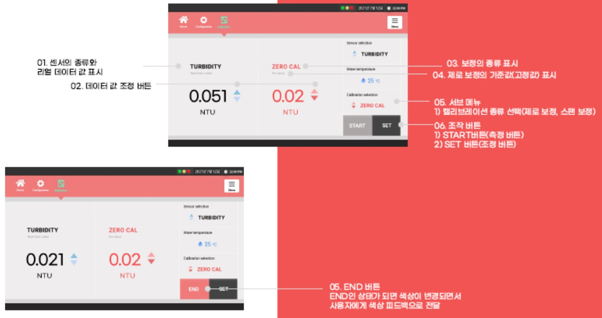

# RSX431 보정방법

RSX431 수질감지 모니터링 시스템에서 개별센서를 보정할 수 있는 기능이 있습니다. 각각의 센서는 보정주기에 따라 보정을 실시하여야 합니다. 

보정\(Calibration\)은 완전히 숙지한 상태에서 실시하여야 하며 잘못된 보정은 센서 측정값 오류의 원인이 됩니다. 각각의 센서 보정주기는 다음과 같습니다.

| 수질 센서 | 권장 보정주기 \(Calibration term\) |
| :---: | :---: |
| 탁도 \(Turbidity\) | 12 개월 \(설치환경 및 수질에 따라 변동됨\) |
| 잔류염소 \(Residual chlorine\) | 6 개월 \(설치환경 및 수질에 따라 변동됨\) |
| 수소이온농도 \(pH\) | 6 개월 \(설치환경 및 수질에 따라 변동됨\) |
| 전기전도도 \(EC\) | 6 개월 \(설치환경 및 수질에 따라 변동됨\) |

보정\(Calibration\) 화면은 다음 그림과 같습니다. 

상단의 Calibration 버튼을 클릭하면 접근이 가능하며, 보정은 ZERO CAL과 SPAN CAL로 나누어 있어 2-포인트 보정을 실시합니다.

보정\(Calibration\) 화면에 대한 각 부분 설명은 다음과 같습니다.

## 1. 수소이온농도 \(pH\) 센서

### 측정방법

수소이온농도 \(pH\)는 기준전극과 비교전극으로 구성되어진 pH 측정기를 사용하여 양전극 간에 생성되는 기전력의 차를 이용하여 측정하는 방법입니다. pH는 다음과 같은 식으로 정의됩니다.

$$
pH = F(Ex-Es)/2.303RT
$$

여기서, 

pH : 시료의 수소이온 농도 측정값   
F : 페러데이 \(Faraday\) 상수 \(9.649X104 Coulomb per mole\)   
Ex : 시료에서의 기준전극과 비교전극간의 전위차 \(mV\)   
Es : 표준용액에서의 기준전극과 비교전극간의 전위차 \(mV\)   
R : 기체상수 \(8.314 J_K-1_mole-1\)   
T : 절대온도 \(K\)

### 간섭물질

수소이온농도 \(pH\) 값은 온도에 영향을 받으며, 전극에 이물질이 달라붙어 있는 경우에는 수소이온 농도 전극의 반응이 느리거나 오차를 발생시킬 수 있습니다.

특히 pH 11이상의 알칼리성이나 pH 5 이하의 불화물 시료에서는 오차가 적은 특수 전극을 사용하는 것이 좋습니다. 하지만 먹는 물은 일반적으로 pH 6 ~ 8 사이이므로 일반적인 전극을 사용합니다. 기타 간섭물질은 연속적으로 측정하는 측정기의 원리 및 특성을 고려하여 제거할 수 있습니다.

### 표준용액

| 구분 | 표준용액 |
| :---: | :---: |
| 제로용액 | 정제수 \(탈이온수\) 또는 pH 7 Buffer 용액 |
| 스팬용액 | pH 4 또는 pH 10 Buffer 용액 |

### 보정방법 \(Calibration sequence\)

#### 제로보정 \(ZERO Calibration\)

1. 제로보정을 위한 표준용액을 준비한 후 수소이온농도 센서 유리전극\(Probe\)을 미리 준비한 정제수에 충분히 담가 둔다. 
2. 컴퓨터의 상단메뉴에서 Calibration 버튼을 클릭한 후 ZERO CAL을 선택한다. 
3. 우측 Sensor Selection 버튼에서 pH를 선택한다. 
4. 센서의 유리전극을 정제수에서 꺼내어 거름종이 등으로 가볍게 닦아낸다. 
5. 유리전극을 pH 7 버퍼용액에 담가 pH의 측정결과가 안정화될 때까지 기다린다. 
6. 컴퓨터의 보정화면의 우측 하단의 START 버튼을 클릭하면 pH값이 7.00으로 변한다. 이후 SET 버튼을 클릭하면 제로보정이 완료된다.

#### 스팬보정 \(SPAN Calibration\)

1. 스팬보정을 위한 표준용액을 준비한 후 수소이온농도 센서 유리전극\(Probe\)을 미리 준비한 정제수에 충분히 담가 둔다. 
2. 컴퓨터의 보정화면의 우측 하단의 Calibration Selection을 SPAN CAL로 선택한다. 
3. 우측 적색의 숫자를 pH 4\(또는 pH 10\)으로 화면에 표시되면 유리전극을 pH 7 버퍼용액으로부터 꺼내 거름종이 등으로 가볍게 닦아낸 후 pH 4 \(또는 pH 10\) 표준용액에 담근다. 
4. 화면 우측의 pH의 측정결과가 안정화될 때까지 기다린다. 
5. 컴퓨터의 보정화면의 우측 하단의 START 버튼을 클릭하면 pH 값이 표준용액의 값으로 변한다. 이후 SET 버튼을 클릭하면 스팬보정이 완료된다.

## 2. 전기전도도 \(EC\) 센서

### 측정방법

전기전도도 \(EC\)는 측정하고자 하는 원수\(Water\) 중의 전기전도도를 측정하는 방법은 일반적으로 한 쌍의 고정된 전극으로 된 전도도 셀 등을 사용합니다.

전기전도도 셀은 그 형태, 위치, 전극의 크기에 따라 각각 자체의 셀 상수를 가지고 있습니다. 셀 상수는 전도도 표준용액을 사용하여 결정하거나 셀 상수가 알려진 다른 전도도 셀과 비교하여 결정할 수 있습니다. \(전기전도도 센서의 셀 상수는 1.0임\) 

전기전도도는 다음과 같은 식으로 정의됩니다.

$$
전기전도도 (uS/cm) = C X Lx
$$

여기서, 

C : 셀 상수 \(cm-1\), 전기전도도 센서의 셀 상수는 1.0  
Lx : 측정한 전기전도도 값 \(uS\)

### 간섭물질

전기전도도 \(EC\) 값은 온도에 영향을 받으며, 전극의 표면이 부유물질, 그리스, 오일 등으로 오염될 경우, 정확한 측정을 하기 어렵고 반응시간이 느리게 되므로 전기전도도의 값이 영향을 받을 수 있습니다. 전극 표면을 깨끗이 유지될 수 있도록 유의합니다. 

이때는 세척용액 \(Dilute nitric acid 1% 또는 세제\)에 셀을 담가 2~3분 동안 흔들어 셀을 세척합니다. 세척용액은 MSDS를 미리 읽으신 후 숙지하여 주의 깊게 사용하여야 합니다.

### 표준용액

| 구분 | 표준용액 |
| :---: | :---: |
| 제로용액 | 정제수 \(탈이온수\) |
| 스팬용액 | 1413 uS/cm 표준용액 |



