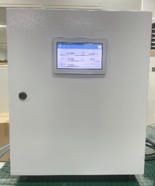
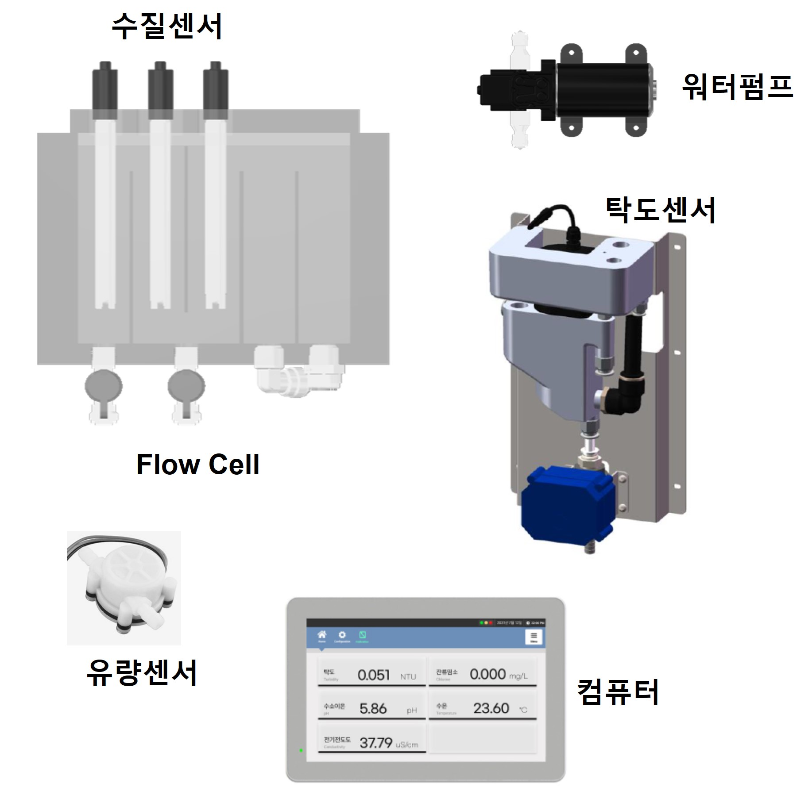
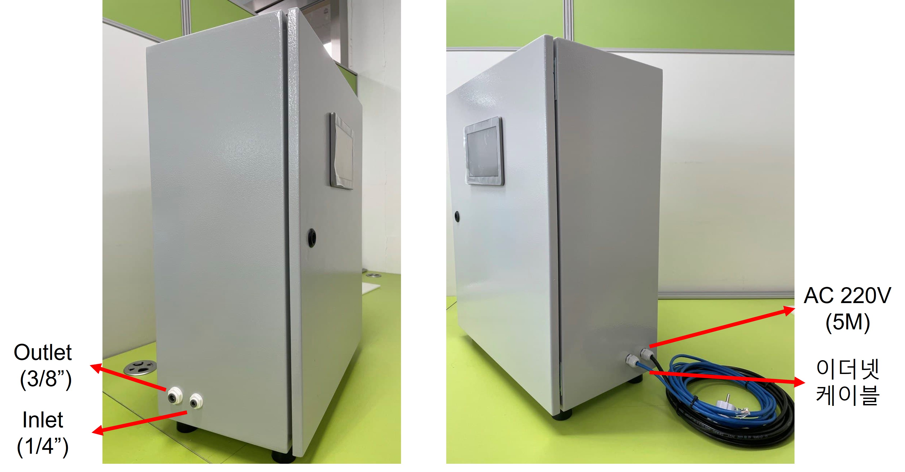
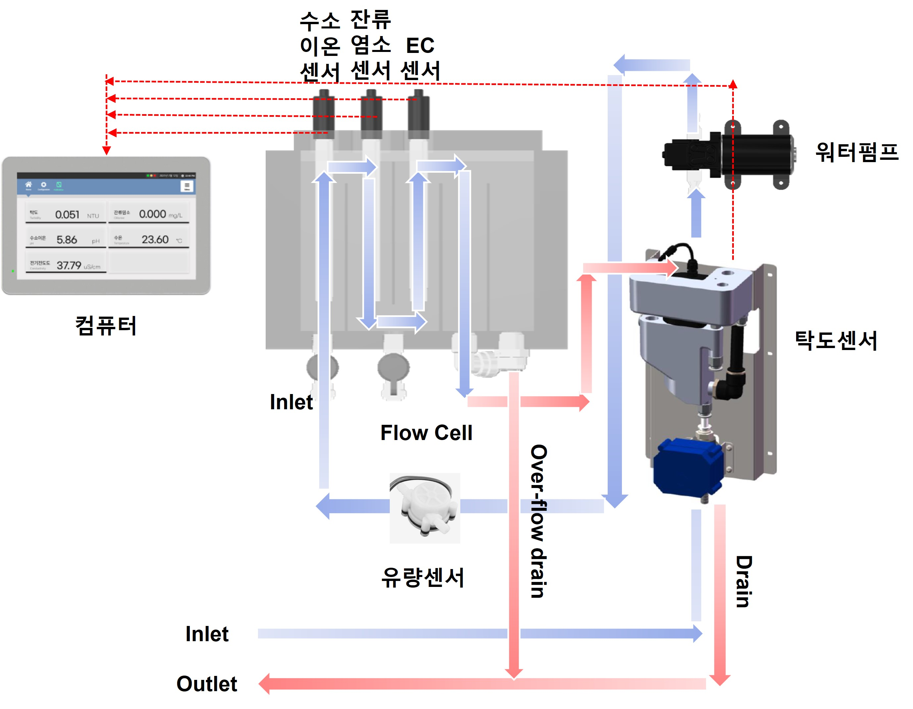

# RSX431 제품의 설명

㈜ 알앤에스랩에서 제공되는 RSX431 수질감지 모니터링 시스템은 아래 그림과 같습니다. 

RSX431은 **방수메탈 박스형**으로 메탈도어는 잠금장치가 있으며, 도어 내부의 우레탄 가스켓은 방수기능 유지를 위해 항상 깨끗한 상태가 유지되어야 합니다. 전원은 **220V 가정용 전원**을 사용합니다.


* RSX431 수질감지 모니터링 시스템을 사용하시기 전에 반드시 사용 설명을 읽으신 후 사용하시기 바랍니다.
* 제품에 대한 문의 등 자세한 사항은 ㈜ 알앤에스랩으로 연락 주시기 바랍니다.


## 1. RSX431 기본구성 

RSX431의 기본 구성은 수질센서 4종 \(탁도, 잔류염소, 수소이온, 전기전도도, 수온 등\), Flow cell, 유량센서, 유량밸브, 워터펌프 및 컴퓨터로 구성되어 있으며, 수질 센서에서 측정된 데이터는 유선 이더넷을 통해 서버로 전송됩니다.

### 기본구성

주요 내부구성은 다음과 같습니다.

#### 수질센서 \(4종\)

수질센서는 4종 센서가 장착되어 있으며, 탁도 \(Turbidity\), 잔류염소 \(Residual chlorine\), 수소이온농도 \(pH\), 전기전도도 \(Electrical conductivity\)로 구성되어 있으며 수온 \(Water Temperature\) 은 잔류염소 센서에 포함된 수온센서로 측정합니다.

#### Flow Cell

각 센서는 Flow Cell에 장착되어 있으며 측정하고자 하는 물은 Flow Cell을 통해 흐르며 탁도 센서 수조를 거쳐서 외부로 배출됩니다. Flow cell의 유량을 감지하는 유량센서가 장착되어 일정유량을 유지할 수 있도록 설계되었습니다.

#### 워터펌프 \(선택\)

공급되는 수압이 부족할 경우, 워터펌프를 통해 원수\(물\)를 공급합니다. 원수의 수압을 조절하기위해 수압조절밸브가 장착되어 일정한 수압을 유지할 수 있도록 설계되었습니다. 원수의 수압이 충분할 경우, 워터펌프는 제외됩니다.

#### 컴퓨터

7인치 터치 스크린을 구비한 컴퓨터의 외부 모니터는 방수기능이 있습니다. 센서의 측정값을 연산하여 실시간으로 디스플레이에 표시합니다. 측정된 값은 이더넷을 통해 서버로 실시간 전송되며 모바일 앱에서 사용자가 확인할 수 있습니다.

<table>
  <thead>
    <tr>
      <th style="text-align:center">&#xAD6C;&#xBD84;</th>
      <th style="text-align:center">&#xC0C1;&#xC138;&#xC0AC;&#xC591;</th>
    </tr>
  </thead>
  <tbody>
    <tr>
      <td style="text-align:center">&#xCEF4;&#xD4E8;&#xD130;</td>
      <td style="text-align:center">
        
7&#xC778;&#xCE58; Color LCD &#xAC10;&#xC555;&#xC2DD; &#xD130;&#xCE58;&#xD328;&#xD2B8;

        
1.2GHz 64&#xBE44;&#xD2B8; &#xCFFC;&#xB4DC;&#xCF54;&#xC5B4; &#xD504;&#xB85C;&#xC138;&#xC11C;

        
&#xC804;&#xBA74; &#xBC29;&#xC218; (IP65)

      </td>
    </tr>
    <tr>
      <td style="text-align:center">&#xCD9C;&#xB825;</td>
      <td style="text-align:center">
        
22 GPIO, 40&#xD540; &#xD5E4;&#xB354;&#xC18C;&#xCF13;

        
USB&#xD3EC;&#xD2B8; (USB 2.0), I2C &#xC9C0;&#xC6D0;

      </td>
    </tr>
    <tr>
      <td style="text-align:center">&#xD1B5;&#xC2E0;</td>
      <td style="text-align:center">&#xC774;&#xB354;&#xB137; &#xD1B5;&#xC2E0; (10/100Mbps)
         &#xBB34;&#xC120;WiFi (&#xC120;&#xD0DD;)</td>
    </tr>
  </tbody>
</table>

### 전면부 및 측면부

수질감지 모니터링 시스템의 전면부 및 측면부 구성은 아래 그림과 같습니다.

## 2. RSX431 수질측정 

RSX431의 내부 원수\(물\)의 흐름은 아래 그림과 같습니다.

먼저, 원수는 수압이 충분하지 않을 경우, 워터펌프에 의해 Flow Cell의 급수 호스 \(Inlet\)를 통해 공급되며 유량센서, 수질센서를 거쳐 마지막으로 탁도 센서의 수조에 공급됩니다. 탁도 센서의 수조는 미세한 기포 \(Bubble\) 생성을 방지하고 기포를 제거하는 구조로 되어 있으며 탁도 센서의 배수 호스 \(Outlet\)를 통해 원수는 외부로 배출됩니다. 

측정수조 \(Flow cell\)로 유입된 원수는 수소이온농도 센서, 잔류염소 센서, 전기전도도 센서, 탁도 센서 순서로 흐릅니다. 일정한 유량을 유지하기 위해 유량센서가 있습니다.

## 3. 수질센서 사양 

### 수소이온농도 센서 \(pH Sensor\)

<table>
  <thead>
    <tr>
      <th style="text-align:center">
        ITEM</th>
      <th style="text-align:center">Specifications</th>
    </tr>
  </thead>
  <tbody>
    <tr>
      <td style="text-align:center">Measuring method</td>
      <td style="text-align:center">Glass pH Electrode</td>
    </tr>
    <tr>
      <td style="text-align:center">Measuring range</td>
      <td style="text-align:center">
        
pH: 0.0 ~ 14.0 pH

        
Temperature: 0 ~ 85.0 &#x2103;

      </td>
    </tr>
    <tr>
      <td style="text-align:center">Accuracy</td>
      <td style="text-align:center">pH: &#xB1; 0.1 pH
         Temperature: &#xB1; 0.5 &#x2103;</td>
    </tr>
    <tr>
      <td style="text-align:center">Temperature compensation</td>
      <td style="text-align:center">10K, 2.252K, PT100, PT1000</td>
    </tr>
    <tr>
      <td style="text-align:center">Slope</td>
      <td style="text-align:center">&#x2265; 96 %</td>
    </tr>
    <tr>
      <td style="text-align:center">Zero-point potential</td>
      <td style="text-align:center">E0 = 7pH &#xB1; 0.3</td>
    </tr>
    <tr>
      <td style="text-align:center">Resolution</td>
      <td style="text-align:center">0.01 pH</td>
    </tr>
    <tr>
      <td style="text-align:center">Maintenance term</td>
      <td style="text-align:center">6 months suggested
         According to the site water quality environment</td>
    </tr>
  </tbody>
</table>

### 전기전도도 센서 \(Electric Conductivity Sensor\)

| ITEM | Specifications |
| :---: | :---: |
| Measuring method | Two electrodes |
| Constant of electrode | 1.0 |
| Measuring range | 0 ~ 2,000 uS/cm |
| Electrode | SS316L |
| Maintenance term | 6 months suggested  According to the site water quality environment |

### 잔류염소 센서 \(Residual chlorine Sensor\)

| ITEM | Specifications |
| :---: | :---: |
| Measuring method | Polarographic amperometry |
| Measuring range | Residual chlorine: 0.00 ~ 20.00 mg/L  Temperature: -10.0 ~ 110.0 ℃ |
| Accuracy | Residual chlorine: ± 0.02 mg/L  Temperature: ± 0.5 ℃ |
| Resolution | Residual chlorine: 0.01 mg/L  Temperature: 0.1 ℃ |
| Operating temperature | 0 ~ 60 ℃ |
| Maintenance term | 6 months suggested  According to the site water quality environment |

### 탁도 센서 \(Turbidity Sensor\)

| ITEM | Specifications |
| :---: | :---: |
| Measuring method | 90˚ Scattering |
| Measuring range | 0 ~ 20 NTU |
| Zero draft | ≤ ± 0.015 NTU |
| Error of display value | ≤ ± 2 % or ± 0.015 NTU |
| Operating temperature | 0 ~ 50 ℃ |
| Maintenance term | 12 months suggested  According to the site water quality environment |

