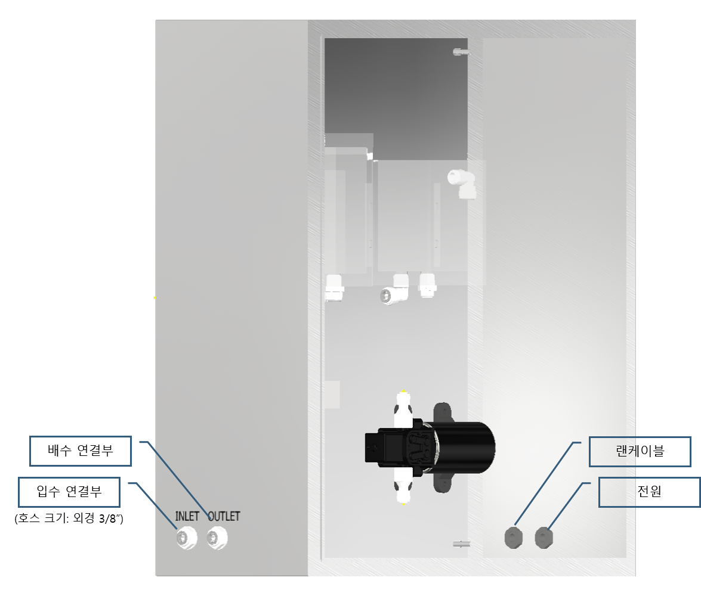
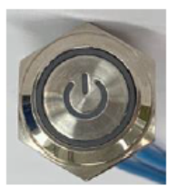
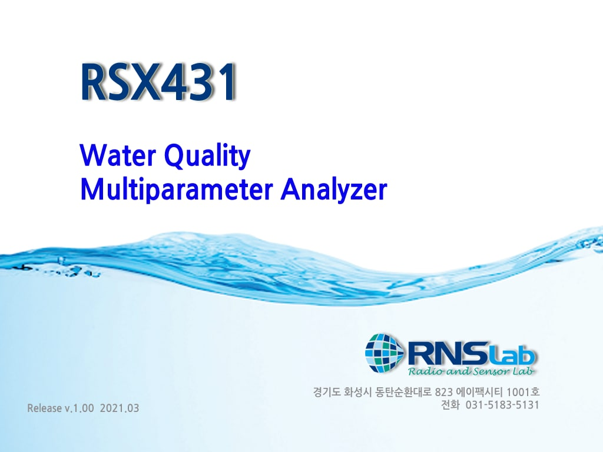
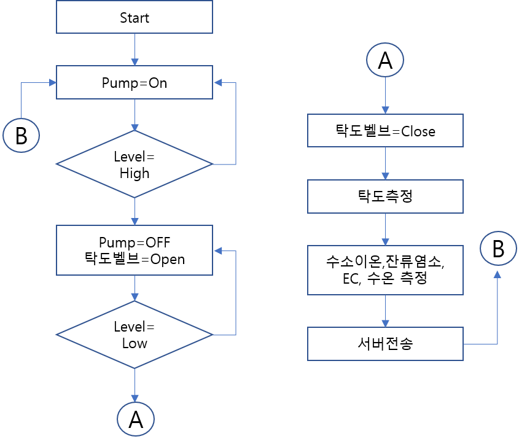

# RSX431 제품의 설명

## 설치 방법 

1. 입수 공급 호스를 수질측정기 좌측 입수 연결부에 연결한다.
2. 배수 호스를 수질측정기 좌측 배수 연결부에 연결한다.
3. 전원 코드를 220V 전원 단자에 연결한다.
4. 랜케이블을 인터넷 단자에 연결한다.

## 사용 방법 

### 1. 전원 연결 

* Door를 열어 전원 버튼을 누른다.
* 부팅과 동시에 Pump가 켜졌다가 꺼진다.

### 2. 소프트웨어 프로그램 실행 

* PC 부팅이 끝나면 프로그램이 자동 실행된다.
* 자동 실행이 되지 않을 시에는 terminal button을 두 번 눌러 실행한다.

### 3. 프로그램 동작 

* 프로그램이 실행되면 아래와 같은 순서로 프로그램이 동작 된다.
* 수질을 측정 데이터는 모니터에 출력 되며, 동시에 서버로 전송되어 WEB과 안드로이드 어플에서도 확인할 수 있다.

### 4. PC 화면의 각 부분 명칭 

> ① pH센서 출력    ② pH 센서 Code data   ③ pH센서 Calibration part \(사용자 Modify\)  
> ④ EC 센서 출력   ⑤ Chlorine 센서 출력   ⑥ Turbidity 센서 출력   ⑦ Temp 센서 출력  
> ⑧ Calibration temp 설정값 \(사용자 Modify\)   ⑨ Error 출력창   ⑩ 현재 상태 출력창  
> ⑪ Calibration On/Off Button \(사용자 Modify\)

