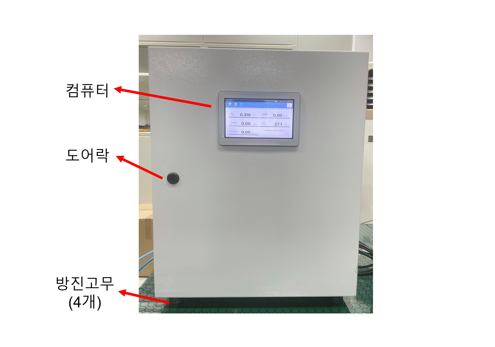

# RSX431 제품의 설명

㈜ 알앤에스랩에서 제공되는 RSX431 수질감지 모니터링 시스템은 아래 그림과 같습니다. 

RSX431은 **방수메탈 박스형**으로 메탈도어는 잠금장치가 있으며, 도어 내부의 우레탄 가스켓은 방수기능 유지를 위해 항상 깨끗한 상태가 유지되어야 합니다. 전원은 **220V 가정용 전원**을 사용합니다.


* RSX431 수질감지 모니터링 시스템을 사용하시기 전에 반드시 사용 설명을 읽으신 후 사용하시기 바랍니다.
* 제품에 대한 문의 등 자세한 사항은 ㈜ 알앤에스랩으로 연락 주시기 바랍니다.


## 1. RSX431 기본구성 

RSX431의 기본 구성은 수질센서 4종 \(탁도, 잔류염소, 수소이온, 전기전도도, 수온 등\), Flow cell, 유량센서, 유량밸브, 워터펌프 및 컴퓨터로 구성되어 있으며, 수질 센서에서 측정된 데이터는 유선 이더넷을 통해 서버로 전송됩니다.

### 기본구성

주요 내부구성은 다음과 같습니다.

#### 수질센서 \(4종\)

수질센서는 4종 센서가 장착되어 있으며, 탁도 \(Turbidity\), 잔류염소 \(Residual chlorine\), 수소이온농도 \(pH\), 전기전도도 \(Electrical conductivity\)로 구성되어 있으며 수온 \(Water Temperature\) 은 잔류염소 센서에 포함된 수온센서로 측정합니다.

#### Flow Cell

각 센서는 Flow Cell에 장착되어 있으며 측정하고자 하는 물은 Flow Cell을 통해 흐르며 탁도 센서 수조를 거쳐서 외부로 배출됩니다. Flow cell의 유량을 감지하는 유량센서가 장착되어 일정유량을 유지할 수 있도록 설계되었습니다.

#### 워터펌프 \(선택\)

공급되는 수압이 부족할 경우, 워터펌프를 통해 원수\(물\)를 공급합니다. 원수의 수압을 조절하기위해 수압조절밸브가 장착되어 일정한 수압을 유지할 수 있도록 설계되었습니다. 원수의 수압이 충분할 경우, 워터펌프는 제외됩니다.

#### 컴퓨터

7인치 터치 스크린을 구비한 컴퓨터의 외부 모니터는 방수기능이 있습니다. 센서의 측정값을 연산하여 실시간으로 디스플레이에 표시합니다. 측정된 값은 이더넷을 통해 서버로 실시간 전송되며 모바일 앱에서 사용자가 확인할 수 있습니다.

<table>
  <thead>
    <tr>
      <th style="text-align:center">&#xAD6C;&#xBD84;</th>
      <th style="text-align:left">&#xC0C1;&#xC138;&#xC0AC;&#xC591;</th>
    </tr>
  </thead>
  <tbody>
    <tr>
      <td style="text-align:center">&#xCEF4;&#xD4E8;&#xD130;</td>
      <td style="text-align:left">
        <ul>
          <li>7&#xC778;&#xCE58; Color LCD &#xAC10;&#xC555;&#xC2DD; &#xD130;&#xCE58;&#xD328;&#xD2B8;</li>
          <li>1.2GHz 64&#xBE44;&#xD2B8; &#xCFFC;&#xB4DC;&#xCF54;&#xC5B4; &#xD504;&#xB85C;&#xC138;&#xC11C;</li>
          <li>&#xC804;&#xBA74; &#xBC29;&#xC218; (IP65)</li>
        </ul>
      </td>
    </tr>
    <tr>
      <td style="text-align:center">&#xCD9C;&#xB825;</td>
      <td style="text-align:left">
        <ul>
          <li>22 GPIO, 40&#xD540; &#xD5E4;&#xB354;&#xC18C;&#xCF13;</li>
          <li>USB&#xD3EC;&#xD2B8; (USB 2.0), I2C &#xC9C0;&#xC6D0;</li>
        </ul>
      </td>
    </tr>
    <tr>
      <td style="text-align:center">&#xD1B5;&#xC2E0;</td>
      <td style="text-align:left">
        <ul>
          <li>&#xC774;&#xB354;&#xB137; &#xD1B5;&#xC2E0; (10/100Mbps), &#xBB34;&#xC120;WiFi
            (&#xC120;&#xD0DD;)</li>
        </ul>
      </td>
    </tr>
  </tbody>
</table>

### 전면부 및 측면부

수질감지 모니터링 시스템의 전면부 및 측면부 구성은 아래 그림과 같습니다.

## 사용 방법 

### 1. 전원 연결 

* Door를 열어 전원 버튼을 누른다.
* 부팅과 동시에 Pump가 켜졌다가 꺼진다.

### 2. 소프트웨어 프로그램 실행 

* PC 부팅이 끝나면 프로그램이 자동 실행된다.
* 자동 실행이 되지 않을 시에는 terminal button을 두 번 눌러 실행한다.

### 3. 프로그램 동작 

* 프로그램이 실행되면 아래와 같은 순서로 프로그램이 동작 된다.
* 수질을 측정 데이터는 모니터에 출력 되며, 동시에 서버로 전송되어 WEB과 안ㄹ드로이드 어플에서도 확인할 수 있다.

### 4. PC 화면의 각 부분 명칭 

> ① pH센서 출력    ② pH 센서 Code data   ③ pH센서 Calibration part \(사용자 Modify\)  
> ④ EC 센서 출력   ⑤ Chlorine 센서 출력   ⑥ Turbidity 센서 출력   ⑦ Temp 센서 출력  
> ⑧ Calibration temp 설정값 \(사용자 Modify\)   ⑨ Error 출력창   ⑩ 현재 상태 출력창  
> ⑪ Calibration On/Off Button \(사용자 Modify\)

