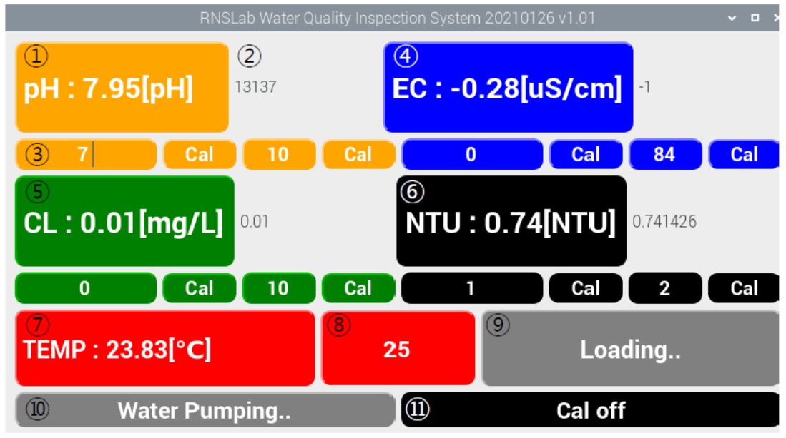
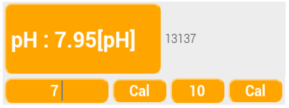
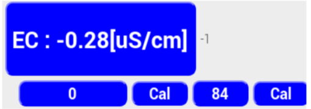
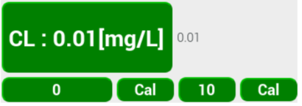

# Calibration

## 수질 센서의 교정 

PC 화면의 오른쪽 하단의 **Cal ON/OFF 버튼** \(⑪ 버튼\)을 클릭해 Cal On에서 진행한다. 


펌프가 동작 중일 때는 교정\(Calibration\)을 진행하지 않는다.


### 1. 수소이온농도 \(pH\) 센서 교정 


준비물:  증류수, pH 7 Buffer 용액, pH 10 Buffer 용액


1. pH센서 프로브를 증류수로 세척하고 물기를 제거한 후 버퍼 7 용액에 1분 동안 담근다.
2. pH 값과 CODE 변화가 안정 되면, 첫번째 칸에 숫자 7을 입력하고 cal 버튼을 click 한다.
3. Probe를 증류수로 세척하고 물기를 제거한 후 Buffer 10 용액에 1분 동안 담근다.
4. pH 값과 Code 값의 변화가 안정되면 두번째 칸에 숫자 10을 입력하고 Cal 버튼을 클릭한다.
5. Calibration이 진행되는 동안 pH 값과 함께 온도도 측정이 된다. \(그림 1. "⑦ Temp 센서 출력" 참고\) 해당 온도에 대한 보정은 Cal 값에 자동으로 보정되어 저장된다.

### 2. 전기전도도\(EC\) 센


준비물:  증류수, DI water, EC 표준용액 \(84uS/cm\)


1. Probe를 증류수로 세척하고 물기를 제거한 후 DI water에 1분 동안 담근다.
2. EC 값과 CODE 변화가 안정이 되면 첫번째 칸에 숫자 0를 입력하고 cal 버튼을 click 한다.
3. Probe를 증류수로 세척하고 물기를 제거한 후 84uS/cm 표준용액에 1분 동안 담근다.
4. EC 값과 CODE 변화가 안정이 되면 두번째 칸에 숫자 84를 입력하고 cal 버튼을 click 한다.
5. Calibration이 진행되는 동안 pH 값과 함께 온도도 측정이 된다. \(그림 1. "⑦ Temp 센서 출력" 참고\)

   해당 온도에 대한 보정은 Cal 값에 자동으로 보정되어 저장된다.

### 3. 잔류염소\(Chlorine\) 센서


준비물:  증류수, DI water, Chlorine 표준용액 \(10mg/L\)


1. Probe를 증류수로 세척하고 물기를 제거한 후 DI water에 1분 동안 담근다.
2. Chlorine 값과 CODE 변화가 안정이 되면 첫번째 칸에 숫자 0를 입력하고 cal 버튼을 click 한다.
3. Probe를 증류수로 세척하고 물기를 제거한 후 10mg/L 표준용액에 1분 동안 담근다.
4. EC 값과 CODE 변화가 안정이 되면 두번째 칸에 숫자 10를 입력하고 cal 버튼을 click 한다.
5. Calibration이 진행되는 동안 EC 값과 함께 온도도 측정이 된다. \(그림 1. "⑦ Temp 센서 출력" 참고\)

   해당 온도에 대한 보정은 Cal 값에 자동으로 보정되어 저장된다.

