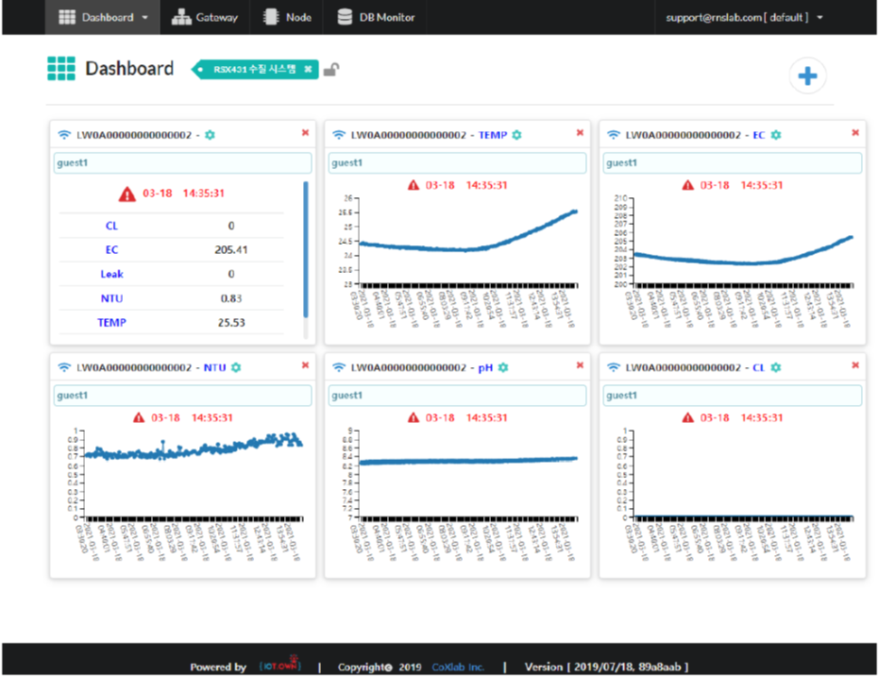
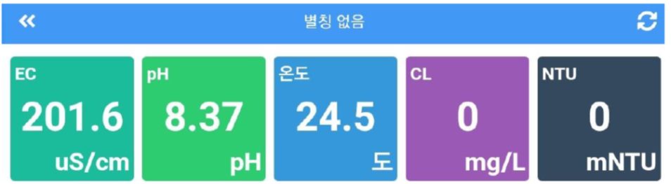

# Cloud service


1. RSX431은 pH/EC/Turbidity/Chloirine/Temp 에 대하여 실시간 측정을 진행하며 랜케이블을 통해 서버로 DATA를 실시간 전송을 한다.
2. DATA 전송 주기 : 3분
3. WEB 과 앱을 통해 DATA를 확인 할 수 있다.


### 1. 웹\(Web\)에서 확인하기 


1. 웹\(Web\) 주소:  [https://52.79.50.2](https://52.79.50.2)
2. ID: support@rsnlab.com
3. PW: 고객에게 별도로 전달 


### 2. 모바일 앱\(App\)에서 확인하기 


1. 안드로이드 어플 다운받기: RNS DATA logger
2. ID: guest1
3. PW: 123456




