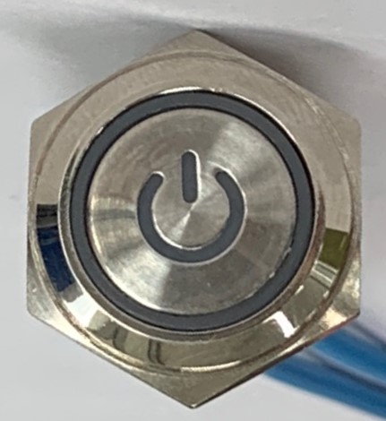
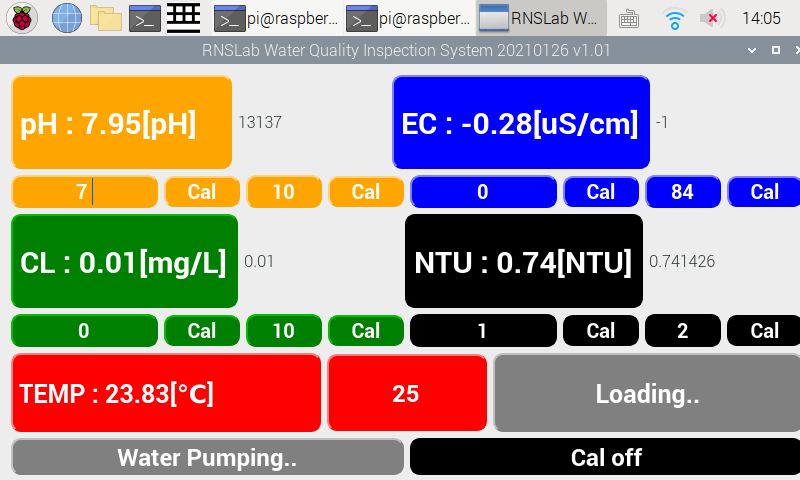
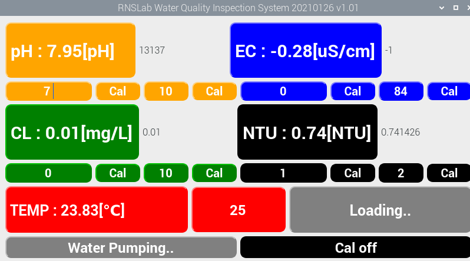
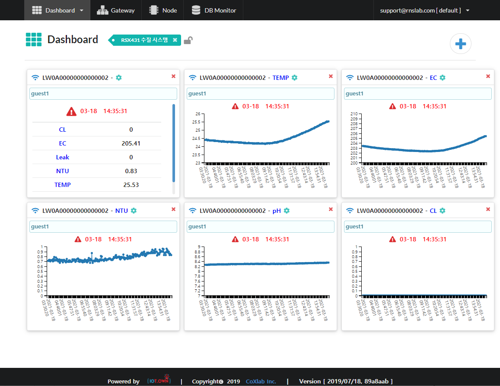
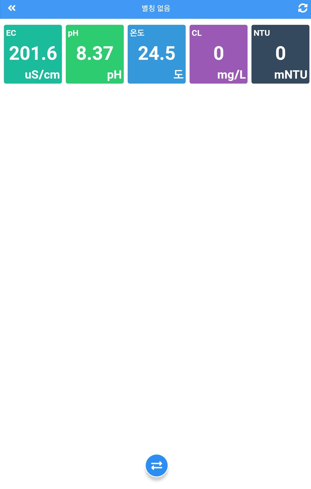

# Introduction

## Introduction

㈜ 알앤에스랩의 **RSX431** 제품은 220V 로 작동되며 계측에 필요한 모든 동작이 PC에 의해 제어되며 pH, EC, Turbidity, Chlorine, Temp 항목이 동시에 측정되는 **멀티 측정기기**이다. 7인치 컬러 LCD의 넓은 화면과 터치패널로 사용자 UI에 쉽게 접근할 수 있으며 사용자가 사용하기 쉬운 화면 구성으로 조작이 간단한 특징을 지닌다. 측정 DATA를 실시간으로 서버로 전송하여 **인터넷 웹, 어플**을 통해 사용자가 무선으로 측정 DATA를 확인할 수 있다.


버전 1.0  
개정일 2021년 3월 26일 



사용 중 문의 사항은 아래로 연락 주시기 바랍니다.  
  
\(주\) 알앤에스랩  
경기도 화성시 동탄순환대로 823 에이팩시티 100호  
www.RNSLab.com  
이메일: admin@rnslab. com  
전화: 031-5183-5131


## 

### 제품 설치

\(호스 크기: 외경 3/8”\)

전원

랜케이블

배수 연결부

입수 연결부

\[그림4\] 수질측정기 측면

* * 1. 입수 공급 호스를 수질측정기 좌측 입수 연결부에 연결한다.
    2. 배수 호스를 수질측정기 좌측 배수 연결부에 연결한다.
    3. 전원 코드를 220V 전원 단자에 연결한다.
    4. 랜케이블을 인터넷 단자에 연결한다. 

## 사용방법

### 전원 연결

* Door를 열어 전원 버튼을 누른다.
* 부팅과 동시에 Pump가 켜졌다가 꺼진다.

### 프로그램 실행

* PC 부팅이 끝나면 프로그램이 자동 실행된다.
* 자동 실행이 되지 않을 시에는 terminal button을 두 번 눌러 실행한다.

### 프로그램 동작

* * 프로그램이 실행되면 다음과 같은 알고리즘으로 프로그램이 운영된다.
* 측정된 DATA는 모니터에 출력되며 서버로 전송되어 WEB과 안드로이드 어플에서도 확인이 가능하다.

### GUI 각 부분 명칭 설명

①

②

③

④

⑤

⑥

⑦

⑧

⑨

⑩

⑪

* * 1. pH센서 출력
    2. pH 센서 Code data
    3. pH센서 Calibration part \(사용자 Modify\)
    4. EC 센서 출력
    5. Chlorine 센서 출력
    6. Turbidity 센서 출력
    7. Temp 센서 출력
    8. Calibration temp 설정값 \(사용자 Modify\)
    9. Error 출력창
    10. 현재 상태 출력창
    11. Calibration On/Off Button \(사용자 Modify\)

## Calibration

* UI의 오른쪽 하단의 Cal ON/OFF 버튼을 클릭해 Cal Mode에서 진행한다. 단 Pump가 가동 중일 때에는 Calibration을 진행하지 않는다.

### 수소이온 농도\(ph\) 센서

* * 1. 준비물 : 증류수, pH 7 Buffer 용액, pH 10 Buffer 용액
    2. 진행 방법

* * * 1. Probe를 증류수로 세척하고 물기를 제거한 후 Buffer7 용액에 1분 동안 담근다.
      2. pH 값과 CODE 변화가 안정이 되면 첫번째 칸에 숫자 7을 입력하고 cal 버튼을 click 한다.

* * * 1.  Probe를 증류수로 세척하고 물기를 제거한 후 Buffer10 용액에 1분 동안 담근다.
      2. pH 값과 CODE 변화가 안정이 되면 두번째 칸에 숫자 10을 입력하고 cal 버튼을 click 한다.

* * * 1. Calibration이 진행되는 동안 pH 값과 함께 온도도 측정이 된다. 해당 온도에 대한 보정은 Cal 값에 자동으로 보정되어 저장된다.

### 전기전도도\(EC\) 센서

* * 1. 준비물 : 증류수, DI water, EC 표준용액 \(84uS/cm\)
    2. 진행 방법

* * * 1. Probe를 증류수로 세척하고 물기를 제거한 후 DI water에 1분 동안 담근다.
      2. EC 값과 CODE 변화가 안정이 되면 첫번째 칸에 숫자 0를 입력하고 cal 버튼을 click 한다

* * * 1. Probe를 증류수로 세척하고 물기를 제거한 후 84uS/cm 표준용액에 1분 동안 담근다.
      2. EC 값과 CODE 변화가 안정이 되면 두번째 칸에 숫자 84를 입력하고 cal 버튼을 click 한다.

* * * 1. Calibration이 진행되는 동안 pH 값과 함께 온도도 측정이 된다. 해당 온도에 대한 보정은 Cal 값에 자동으로 보정되어 저장된다.

### 잔류염소\(Chlorine\) 센서

* * 1. 준비물 : 증류수, DI water, Chlorine 표준용액 \(10mg/L\)
    2. 진행 방법

* * * 1. Probe를 증류수로 세척하고 물기를 제거한 후 DI water에 1분 동안 담근다.
      2. Chlorine 값과 CODE 변화가 안정이 되면 첫번째 칸에 숫자 0를 입력하고 cal 버튼을 click 한다

* * * 1. Probe를 증류수로 세척하고 물기를 제거한 후 10mg/L 표준용액에 1분 동안 담근다.
      2. EC 값과 CODE 변화가 안정이 되면 두번째 칸에 숫자 10를 입력하고 cal 버튼을 click 한다.

Calibration이 진행되는 동안 pH 값과 함께 온도도 측정이 된다.  
해당 온도에 대한 보정은 Cal 값에 자동으로 보정되어 저장된다.

## DATA 확인

* RSX431은 pH/EC/Turbidity/Chloirine/Temp 에 대하여 실시간 측정을 진행하며 랜케이블을 통해 서버로 DATA를 실시간 전송을 한다.
* DATA 전송 주기 : 3분
* WEB 과 앱을 통해 DATA를 확인 할 수 있다.

### WEB 에서 확인하기

* * WEB site 주소 : [https://52.79.50.2](https://52.79.50.2/)
  * ID : [support@rnslab.com](mailto:support@rnslab.com)
  * PW :

### 모바일 APP에서 확인하기

* * 안드로이드 어플 다운 받기 : RNS DATA logger
  * ID : [guest1](mailto:support@rnslab.com)
  * PW : 123456

